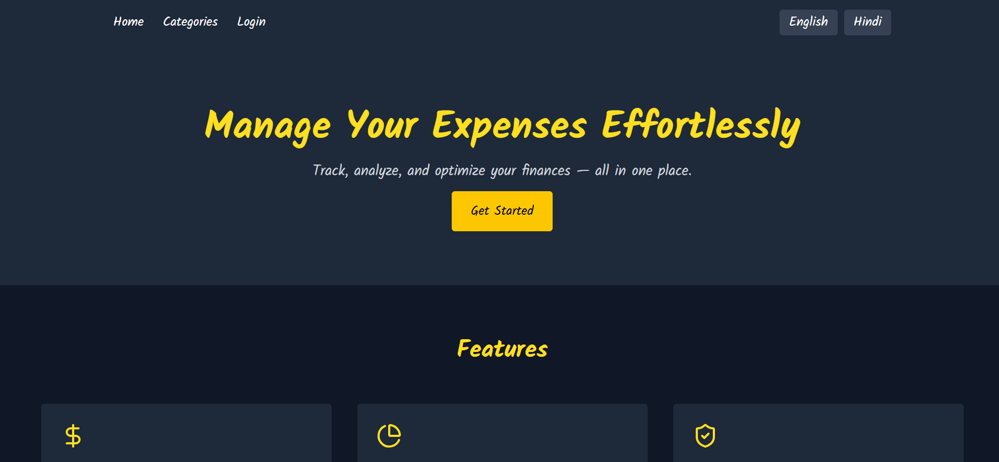

# Expense Manager App

[](https://app.netlify.com/projects/bokaro-book/deploys)

Expense Manager is a modern web application built with React, TypeScript, and Vite. It helps you track your expenses, manage categories, and view your spending history with a clean and intuitive interface.




## Features

- User authentication (login/register)
- Add, edit, and delete expenses
- Categorize expenses
- View expenses by category
- Responsive and modern UI
- Internationalization (English & Hindi)

## Tech Stack

- [React](https://react.dev/) + [TypeScript](https://www.typescriptlang.org/)
- [Vite](https://vitejs.dev/) for fast development
- [Redux Toolkit](https://redux-toolkit.js.org/) for state management
- [Supabase](https://supabase.com/) for backend services
- [ESLint](https://eslint.org/) for code quality

## Getting Started

1. **Install dependencies:**
   ```bash
   npm install
   ```
2. **Start the development server:**
   ```bash
   npm run dev
   ```
3. **Build for production:**
   ```bash
   npm run build
   ```

## Project Structure

- `src/components/` - Reusable UI components
- `src/features/` - Feature-specific logic (auth, category, expense)
- `src/pages/` - Application pages
- `src/redux/` - Redux slices and store
- `src/services/` - API and backend services
- `src/layouts/` - Layout components
- `src/locales/` - Localization files

## License

MIT
